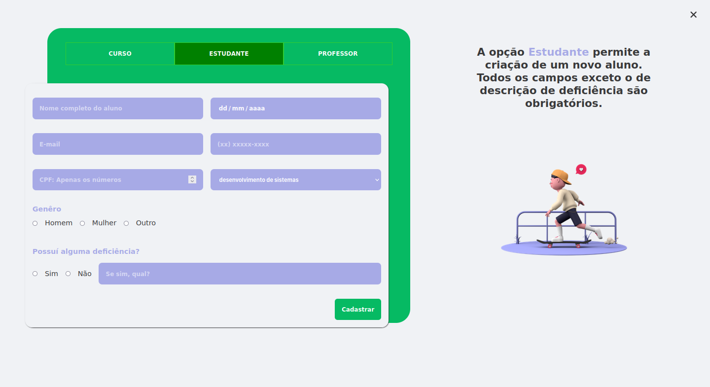
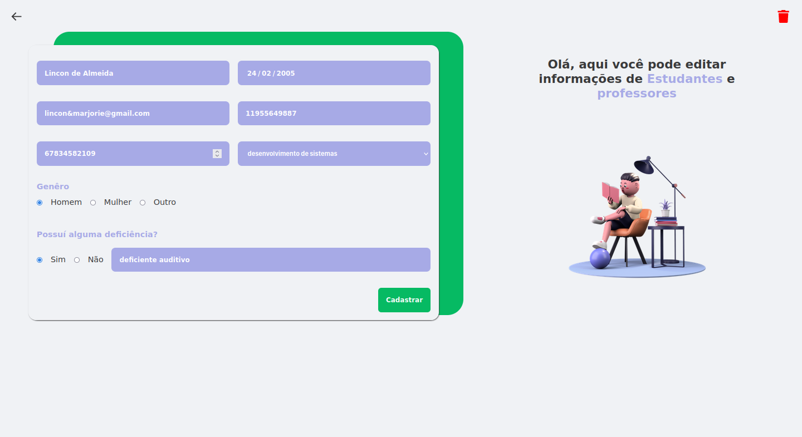

# TodoList with ReactJS - Rocketseat Ignite

Hi, in this repository you will find the source code of a project built with NextJS and another technologies. All the Project was pre-planned before to code. I've created the DFD (Data Flow Diagram); Requeriments Analysis; sketches on Figma and Mockflow to create the WireFrame among other things. To find all informations click [here](https://www.notion.so/Desafio-AX4B-CRUD-44e7fc11c839405ea7debb5a9e7db3d0). The application is a webpage to manipulate school informations such as student and teacher enrollments. The application allow us to create, update read and delete data using an API built from zero with NODE and Typescript.

## Status

🚀 ...finished... 🚀

## Requirements and How to use

To run this application locally you just need to install [node](https://nodejs.org/en/) in your computer. By doing that npm (node package manager) will be installed too. So know you can start the application by running:

```bash
# Install all dependencies
npm install

# Start the application
npm run dev

```

If you prefer you can run by using `yarn` instead:

```bash
# Install yarn in computer globally
npm install yarn --global

# Install all dependencies with yarn
yarn


# Start the application with yarn
yarn dev

```

## Preview







## Techonologies

- NextJS (React) - To use JSX syntax and build SPA Website
- typescript - To apply types to our variables
- Framer Motion - To apply animations on components
- Styled-Components - To build the css styled components
- Axios To handle CRUD actions which communicates with the [restfull_ax4b](https://github.com/VictorSilva15/restfulapi_ax4b) API
- google fonts - DM Sans fonts to our text
- commitlint - To verify the structures of commits prior to push them
- commitizen - To give us a CLI to build our commits in commitlint pattern
- husky - To execute functions hooks prior git commands

### EDITOR

- [Visual Studio Code](https://code.visualstudio.com/)

---

## 💪 How to contribute to the project

1. **Fork** the project.

2. Create a new branch with your changes: `git checkout -b my-feature`

3. Save the changes and create a commit message telling what you did: `git commit -m "feature: My new feature"`

4. Push your changes: `git push origin my-feature`

> If you have any questions, check out this [guide on how to contribute on GitHub](./CONTRIBUTING.md)

## Author

<div>


<sub><b>Victor Hugo 🚀</b></sub>

## 📝 Licença

This project is under MIT license [MIT](./LICENSE).

Made with dedication by VictorSilva15

---
